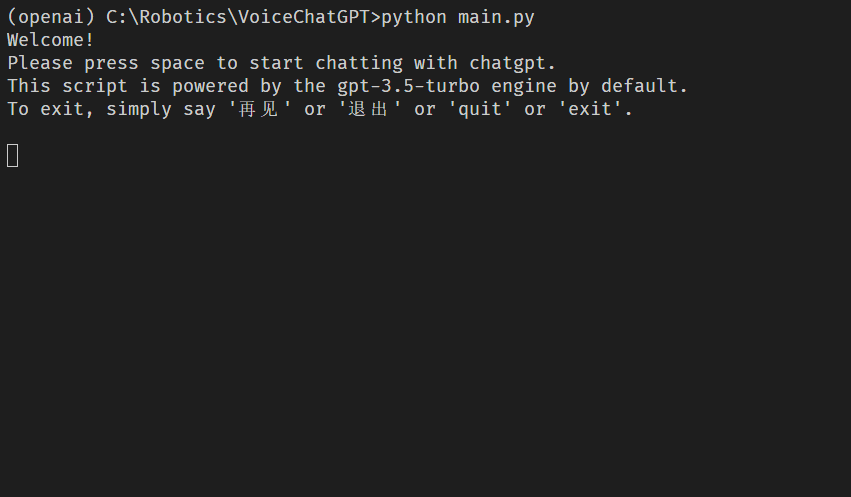

# VoiceChatGPT



A simple script for Voice Talk with ChatGPT.

* Use pyaudio for voice recording
* Use OpenAI's API for speech-to-text transcription and conversation completion
* Use the pyttsx3 engine for text-to-speech conversion (replace with other APIs for better voice quality)


## Setup
1. Create a new virtual environment

   ```bash
   $ conda create -n openai python
   $ conda activate openai
   ```

2. Install the requirements

   ```bash
   $ pip install -r requirements.txt
   ```

   For M1 Mac users, check [this solution](https://discussions.apple.com/thread/252638887?answerId=255859874022#255859874022) if you are having trouble with PyAudio installation.

3. Make a copy of the example environment variables file

   ```bash
   $ cp .env.example .env
   ```

4. Add your [API key](https://beta.openai.com/account/api-keys) to the newly created `.env` file

5. Run the app

   ```bash
   $ python main.py  # add --text to use text mode
   ```

## Todo-List

- [x] text chat
- [x] speech to text
- [x] text to speech
- [x] exception handling
- [ ] save & load chat log